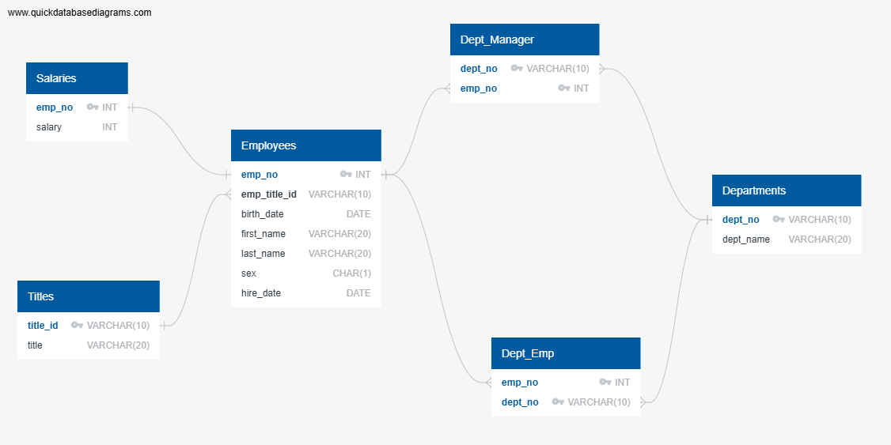

# SQL Assignment

## Data Modeling
There is an image of the ERD I created using QuickDBD:
<figure>
  
</figure>
Once I created all tables in pgAdmin, I checked the ERD that pgAdmin created for my database. They are almost identical, and the only difference is a relationship between the Salaries and Employees tables.
In pgAdmin, they chose to use a Many-to-One relationship. However, I checked the salaries.csv file, and no employee there has more than one row (so every employee has only one salary).
Because of that, I decided that it's better to use relationship a One-to-One for these two tables.
<figure>
  
</figure>
Since the departments have more than one employee/manager and an employee can work/manage more than one department, we have dept_emp and dept_manager junction tables.
The relationship between the Departments and Employees/Managers tables is Many-to-Many, and all these tables have One-to-Many relationships with junction tables. These junction tables have composite primary key (dept_no and emp_no).
</br>
I checked the lengths of the longest value in each string column in each table, and none of them exceed 20 (10 for id). Due to that I decided to use VARCHAR(20) (or VARCHAR(10)) as the type for these columns. For the sex column in the employees table, I used CHAR(1) since it's always only one character.

## Data Engineering
Here are the create queries I executed in order to create all the needed tables. I defined all the required columns for each table and set them to the correct data type.
</br>
Each table has a primary key. All tables correctly reference related tables with foreign keys.
</br>
I used the NOT NULL condition for all columns in all tables since there is no missing data in any of the .csv files.

```sql
CREATE TABLE Departments (
    dept_no VARCHAR(10) NOT NULL PRIMARY KEY,
    dept_name VARCHAR(20) NOT NULL
);

CREATE TABLE Titles (
    title_id VARCHAR(10) NOT NULL PRIMARY KEY,
    title VARCHAR(20) NOT NULL
);

CREATE TABLE Employees (
    emp_no INT NOT NULL PRIMARY KEY,
    emp_title_id VARCHAR(10) NOT NULL REFERENCES Titles(title_id),
    birth_date DATE NOT NULL,
    first_name VARCHAR(20) NOT NULL,
    last_name VARCHAR(20) NOT NULL,
    sex CHAR(1) NOT NULL,
    hire_date DATE NOT NULL
);

CREATE TABLE Salaries (
    emp_no INT NOT NULL PRIMARY KEY REFERENCES Employees(emp_no),
    salary INT NOT NULL
);

CREATE TABLE Dept_Emp (
    emp_no INT NOT NULL REFERENCES Employees(emp_no),
    dept_no VARCHAR(10) NOT NULL REFERENCES Departments(dept_no),
    PRIMARY KEY (emp_no, dept_no)
);

CREATE TABLE Dept_Manager (
    dept_no VARCHAR(10) NOT NULL REFERENCES Departments(dept_no),
    emp_no INT NOT NULL REFERENCES Employees(emp_no),
    PRIMARY KEY (dept_no, emp_no)
);
```
I executed them in the following order so there are no errors that may occur due to the foreign key constraints. Then, I imported all the data from .csv files to the corresponding tables.
</br>
The assignment requirement asked to create a schemata .sql file. I created one using pgAdmin Backup option (db_schemata.sql). It is pretty big, so I also created a separate file (create_queries.sql) where I just put my drop-if-exists and create queries.

## Data Analysis
Here you can see queries and screenshots of their execution (they can also be found in select_queries.sql file).
<ol>

<li><b>List the employee number, last name, first name, sex, and salary of each employee.</b>

```sql
SELECT emp_no, last_name, first_name, sex, salary
FROM employees
	JOIN salaries USING (emp_no);
```

<figure>
  
</figure>
</li>

<li><b>List the first name, last name, and hire date for the employees who were hired in 1986.</b>

```sql
SELECT first_name, last_name, hire_date
FROM employees
WHERE hire_date BETWEEN '1986-01-01' AND '1986-12-31';
```

<figure>
  
</figure>
</li>

<li><b>List the manager of each department along with their department number, department name, employee number, last name, and first name.</b>

```sql
SELECT d.dept_no, d.dept_name, e.emp_no, e.last_name, e.first_name
FROM departments AS d
	JOIN dept_manager USING (dept_no)
	JOIN employees AS e USING (emp_no);
```

<figure>
  
</figure>
</li>

<li><b>List the department number for each employee along with that employee’s employee number, last name, first name, and department name.</b>

```sql
SELECT e.emp_no, e.last_name, e.first_name, d.dept_no, d.dept_name
FROM departments AS d
	JOIN dept_emp USING (dept_no)
	JOIN employees AS e USING (emp_no);
```

<figure>
  
</figure>
</li>

<li><b>List first name, last name, and sex of each employee whose first name is Hercules and whose last name begins with the letter B.</b>

```sql
SELECT last_name, first_name, sex
FROM employees
WHERE first_name ILIKE 'Hercules'
	AND last_name ILIKE 'B%';
```

<figure>
  
</figure>
</li>

<li><b>List each employee in the Sales department, including their employee number, last name, and first name.</b>

```sql
SELECT e.emp_no, e.last_name, e.first_name
FROM employees AS e
	JOIN dept_emp USING (emp_no)
	JOIN departments AS d USING (dept_no)
WHERE d.dept_name ILIKE 'Sales';
```

<figure>
  
</figure>
</li>

<li><b>List each employee in the Sales and Development departments, including their employee number, last name, first name, and department name.</b>

```sql
SELECT e.emp_no, e.last_name, e.first_name, d.dept_name
FROM employees AS e
	JOIN dept_emp USING (emp_no)
	JOIN departments AS d USING (dept_no)
WHERE d.dept_name ILIKE 'Sales'
	OR d.dept_name ILIKE 'Development';
```

<figure>
  
</figure>
</li>

<li><b>List the frequency counts, in descending order, of all the employee last names (that is, how many employees share each last name).</b>

```sql
SELECT last_name, COUNT(*)
FROM employees
GROUP BY 1
ORDER BY 2 DESC;
```

<figure>
  
</figure>
</li>
</ol>